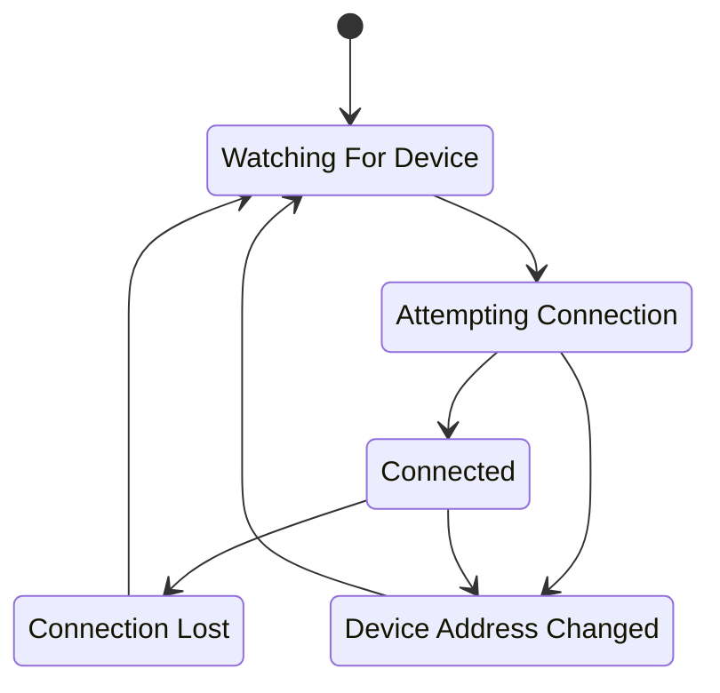

# Connection State Transitions

This document reflects the state transitions that occur in the Connection state
machine.

State transitions are triggered by input events such as network changes, lack of receipt of frames, time passing, and the `Stop` event.

This state chart shows only the states and state transitions, no events.

There is a `Stop` event that is handled in `StateMachine.DispatchEvent()`. This occurs outside the normal state transitions shown here and terminates the state machine.
